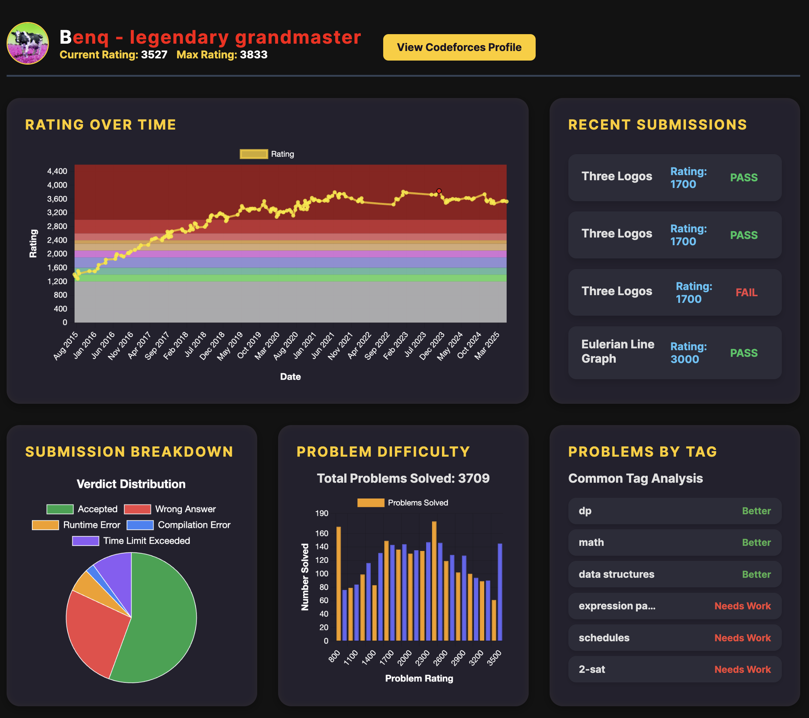
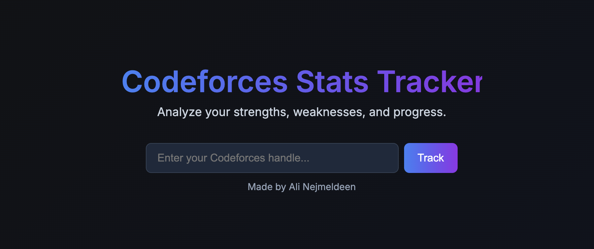
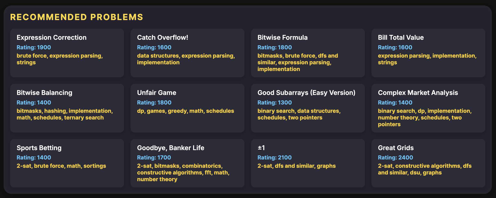

# Codeforces Tracker
### Webpage can be found [here](https://codeforcestracker.com)

A clean and interactive dashboard to visualize Codeforces performance and problem-solving history. 
Provides users with analysis for their rating progression and weaknesses over time.

By analyzing competitive programming history and identifying common weaknesses, this tool helps you focus your practice more efficiently,
reducing solve-time and accelerating your path to becoming a stronger, more consistent programmer.

<table style="border-collapse: collapse;">
  <tr>
    <td style="border: none; padding: 0;">
      
    </td>
    <td style="border: none; padding: 0 0 0 10px;">
       
      
    </td>
  </tr>
</table>

## Features:
- Instant tracking with no account creation necessary
- Dynamic statistics pulled from the Codeforces API
- Statistical analysis of profiles compared to global averages

## Technologies Used:
- HTML, CSS, Javascript
- Codeforces API

***

#### NOTE: 
- Accounts that have not participated in at least one Codeforces contest are unavailable for tracking (due to API issues)
